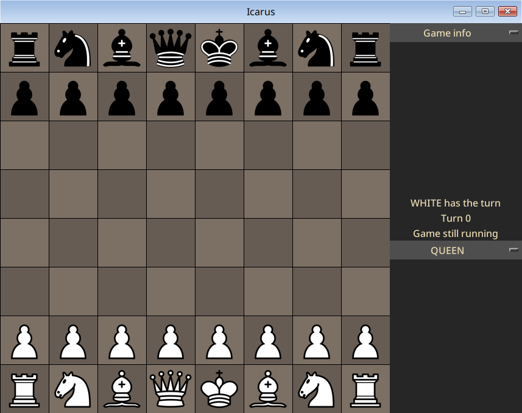

<p align="center">
  
</p>

# Icarus

Simple python chess application with UI

## Screenshots

<p align="center">
  
</p>

## Usage

You can setup a board with UI like this:

```python
import board
import ui

my_board: board.Board = board.Board()
# Pleace pieces in standard chess starting position
my_board.setup()

my_ui: ui.UI = ui.UI()
my_ui.init(my_board)
my_ui.keep_alive()
```
